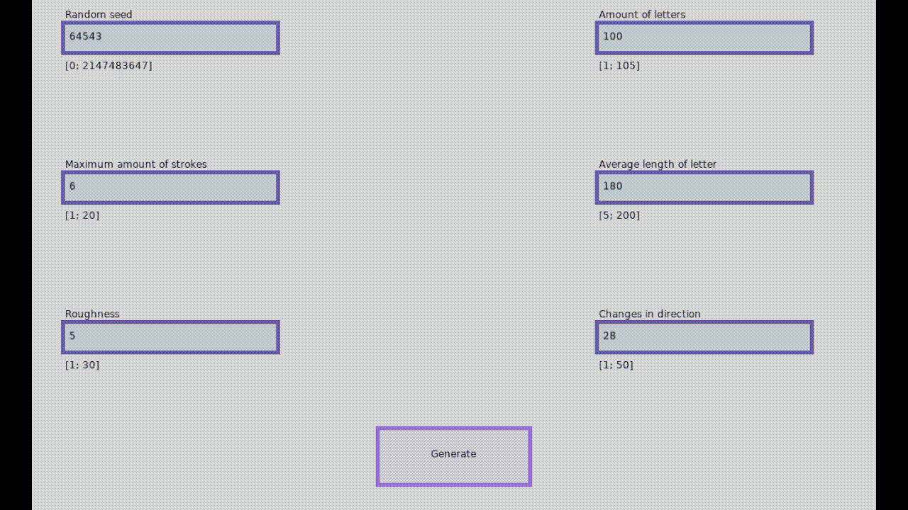

# Alphabet-Generator
Generates a random scripture in accordence to parameters given.

Started the project to get used to Lua and Love2D, doesn't really work as intended but sometimes it gives interesting outputs.

Made using LÖVE2D.
I used https://github.com/rxi/json.lua for decoding and encoding .json files.

To try it out go onto the [releases](https://github.com/Capnsockless/Alphabet-Generator/releases) (instructions are there)
